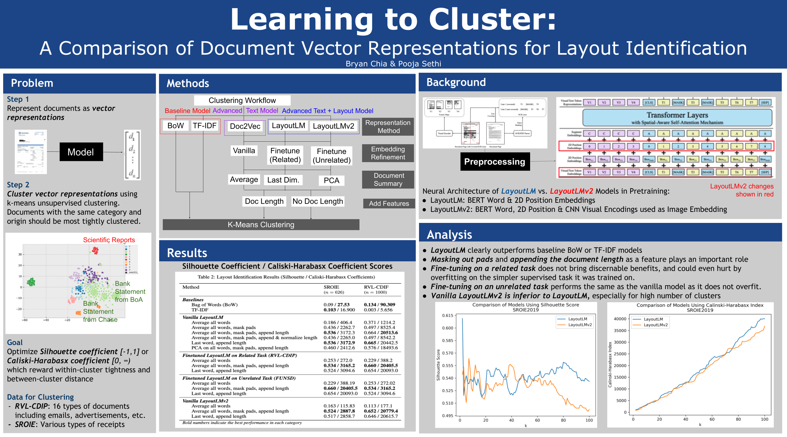

# Document Clustering
This is a library for _unsupervised layout identification_ of documents.
For more details, check out the [paper](https://www.overleaf.com/read/cyfkdbmjmysw).



## Getting started

### Install dependencies in a new conda environment.
`conda env create --name local_env --file=local_env.yml`

### Download datasets
Datasets are available for download [here](https://drive.google.com/drive/folders/1yjovBe7blrTmarF39wk6P_gUwmT0bfk-?usp=sharing).

And should be stored with the following directory structure and names:
```
datasets/rvl-cdip/
datasets/sroie2019/
```
### Download finetuned models.
Models are available for download [here](https://drive.google.com/drive/folders/10DERNJwX_3q4OQ9T-ZPWiFGX8ZKAYDwv?usp=sharing).
And should be stored with the following directory structure and names:
```
finetuned_models/finetuned_related_lmv1/
finetuned_models/finetuned_unrelated_lmv2/
```
### Download embeddings and results from paper.
Prepared document embeddings and experiment results are [here](https://drive.google.com/file/d/1kIEQjUhfW5TdL4Zc4pYW5YD7QYXVBUSU/view?usp=sharing).
And should be stored with the following directory name:
```
results/
```

## Training and running models.

## Get document embeddings from LayoutLM (and variants).
`python get_hidden_states.py -r <rivlets_dir> <model_type>`

`python get_hidden_states.py -r datasets/rvl-cdip/rvl_cdip_processed/base/rivlets/ vanilla_lmv1`

### Run unsupervised clustering
Run one of the commands from EXPERIMENTS.md, or `python clustering.py --help` for example usage.

Add the `--debug` flag to get interactive visualizations as well. For example:
```
python clustering.py -p datasets/sroie2019/
	-r vanilla_lmv2 \
	-e 769 \
	-s average_all_words_mask_pads \
	-o results/sroie2019/vanilla_lmv2/average_all_words_mask_pads \
	--debug
```


